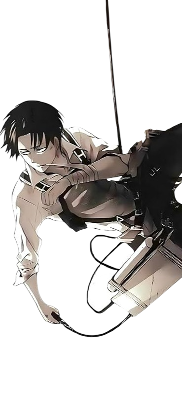

  Hey there! Myself thunderzz. I like working on chromium based extensions, webapps, reverse engineering and electron apps.
    
  <kbd>Developer</kbd> • <kbd>Chromium &lt;3</kbd> • <kbd>Discord.js</kbd>
  

  <h3>Stack</h3>
  

  <h3>Learning</h3>
  

  

<h3>Discord</h3>

 

<h3>Stats</h3>

  <picture>
    <source media="(prefers-color-scheme: dark)" srcset="https://raw.githubusercontent.com/thunderzz12/thunderzz12/output/github-contribution-grid-snake-dark.svg">
    <source media="(prefers-color-scheme: light)" srcset="https://raw.githubusercontent.com/thunderzz12/thunderzz12/output/github-contribution-grid-snake.svg">
    
  </picture>

